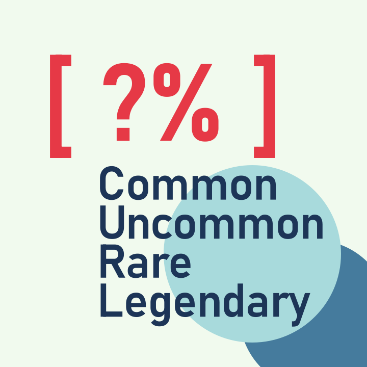

<div align="center">

</div>

# Weighted Choice 


This Godot 4 plugin provide a static `WeightedChoice.pick()` method you can call to randomly choose an item from a dictionary based on weights. 


## Usage: 

> Includes [in-editor documentation](https://i.imgur.com/YAJ6XhG.png)!

`pick(dict: Dictionary, weight_key: Variant)`

Takes a dictionary `dict`, and randomly picks one item based based on weights. 

If `weight_key` is set, the function will search for weights in a nested dictionary.

Returns a key. 

### Examples

```gdscript
# Define weights for ease of use & consistency
const Rarity = {
    "COMMON":0.85,
    "UNCOMMON": 0.10,
    "RARE": 0.05
}
```

#### Non-nested weights:

```gdscript
var dict = {
    "A": Rarity.COMMON,
    "B": Rarity.UNCOMMON,
    "C": Rarity.RARE
}

var key = WeightedChoice.pick(dict) # "A", "B", or "C"
```

#### Nested weights

```gdscript
var dict = {
    "copper": {"name": "Copper item", "rarity": Rarity.COMMON},
    "silver": {"name": "Silver item", "rarity": Rarity.UNCOMMON},
    "gold": {"name": "Gold item", "rarity": Rarity.RARE}
}

var key = WeightedChoice.pick(dict, "rarity") # "copper", "silver", or "gold"

```

## Loot Box Demo


You can check the [loot box demo](https://github.com/rehhouari/WeightedChoice/tree/main/addons/weighted_choice/demo) for an example on how to use this plugin


## Installation

Install from the [Asset Library](https://godotengine.org/asset-library/asset/2290), or clone the repository and move copy the [weighted_choice folder](addons/weighted_choice/) into your addons folder.

> **When installing, you can uncheck the "demo" folder**

## Credits

MIT License

Copyright (c) 2023 Rafik El Hadi Houari

Uses code from Mickeon
https://github.com/godotengine/godot-proposals/issues/3948#issuecomment-1035074260

Demo assets:

https://admurin.itch.io/free-chest-animations
https://snowhex.itch.io/mini-tools-pack-harvestsummer
